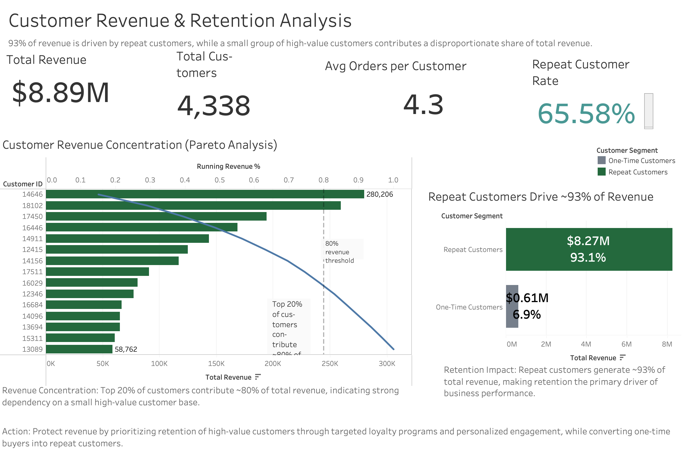

# Customer Retention & Revenue Analysis

> **93.09% of revenue is driven by repeat customers, while the top 10% of customers contribute 61.41% of total sales.**
>
> This project analyzes **541K+ real-world retail transactions** to uncover how customer behavior drives revenue, where concentration risk exists, and why retention is the highest-leverage growth opportunity.

## Executive Summary

This project evaluates customer purchase behavior using transactional retail data from a UK-based online retailer. The analysis shows that revenue is highly dependent on a relatively small group of repeat and high-value customers. Although repeat customers represent **65.58%** of the customer base, they generate **93.09%** of total revenue. At the same time, average **month-2 retention is only 20.62%**, indicating that the largest growth opportunity lies in improving early repeat purchase behavior rather than relying only on acquisition.

From a business perspective, the findings suggest that retention and lifecycle engagement should be prioritized over pure top-of-funnel growth. The business is currently exposed to customer concentration risk, as the **top 10%** of customers contribute **61.41%** of revenue and the **top 20%** contribute **74.66%**.

---

## Business Problem

Most ecommerce businesses try to grow revenue by acquiring more customers. That approach can be expensive and inefficient if the true drivers of growth are hidden inside retention and customer value patterns.

This project addresses three core business questions:

1. **How much revenue is driven by repeat customers versus one-time buyers?**
2. **How concentrated is revenue among the highest-value customers?**
3. **Where does retention weaken, and what does that imply for growth strategy?**

---

## Why This Project Matters

This is not just a descriptive sales report.

It is a customer and revenue strategy analysis that helps answer:

- whether the business is overly dependent on a small share of customers
- whether customer retention is strong enough to support stable growth
- whether lifecycle engagement should be prioritized over incremental acquisition

---

## Dataset

**Source:** UCI Online Retail dataset  
**Type:** Real transactional ecommerce data  
**Time Period:** December 2010 to December 2011  
**Raw Size:** 541,909 rows

The dataset contains invoice-level transaction records, including:
- `InvoiceNo`
- `StockCode`
- `Description`
- `Quantity`
- `InvoiceDate`
- `UnitPrice`
- `CustomerID`
- `Country`

This is a strong dataset for customer analytics because it reflects real purchase behavior, invoice activity, and revenue generation over time.

---

## Analytical Workflow

The project was built as an end-to-end analytics pipeline:

### 1. Data Cleaning and Validation
The raw dataset contained several real-world data quality issues:
- missing customer IDs
- cancellation invoices
- non-positive quantity or unit price values
- duplicate rows

Cleaning steps included:
- removing rows with missing `CustomerID`
- excluding cancelled invoices
- filtering invalid quantity and price values
- parsing invoice timestamps
- removing duplicates
- creating a `TotalPrice` field (`Quantity * UnitPrice`)

### 2. Customer-Level Feature Engineering
A customer summary table was created with one row per customer, including:
- first purchase date
- last purchase date
- invoice count
- total units purchased
- total revenue
- recency
- customer lifespan
- repeat customer flag
- high-value customer flag

### 3. Segmentation Analysis
Compared one-time vs repeat customers using:
- customer count
- average revenue
- median revenue
- average order count
- average recency

### 4. Cohort Retention Analysis
Measured monthly retention by customer acquisition cohort to understand how quickly engagement declines after the first purchase.

### 5. Revenue Concentration Analysis
Quantified how much revenue comes from top customer groups to identify concentration risk.

### 6. SQL-Based Business Queries
Used SQLite to answer additional business questions:
- top countries by revenue
- monthly revenue trend
- top customers by revenue

---

## Key Findings

### 1. Repeat customers are the primary revenue engine
- Repeat customers represent **65.58%** of customers
- Repeat customers generate **93.09%** of total revenue
- One-time customers average **411.25** in revenue
- Repeat customers average **2907.99** in revenue

This means repeat customers generate nearly **7x** higher revenue than one-time buyers.

### 2. Revenue is highly concentrated
- Top **10%** of customers contribute **61.41%** of total revenue
- Top **20%** of customers contribute **74.66%** of total revenue

This indicates meaningful concentration risk: a relatively small customer group drives the majority of the business.

### 3. Retention weakens early
- Average **month-2 retention = 20.62%**
- Average **month-3 retention = 22.11%**

This suggests the biggest drop-off happens soon after the first purchase, making early lifecycle retention the highest-impact opportunity.

### 4. Geographic revenue is uneven
Using SQL analysis:
- The **United Kingdom** contributed **$7.29M** in revenue across **3,920** customers
- Revenue from other countries was materially lower, with Netherlands, EIRE, Germany, and France following at a distance

This shows a strong geographic concentration of revenue.

### 5. Customer concentration is visible at the individual level
The top individual customer generated **$280.21K** in revenue, reinforcing the broader pattern that revenue is disproportionately driven by a small subset of customers.

---

## Business Interpretation

The findings point to a clear strategic conclusion:

**Retention is the highest-leverage growth driver.**

The business is not primarily constrained by acquisition volume. It is constrained by:
- weak early repeat behavior
- heavy dependence on a small customer segment
- revenue concentration risk

If the business improves early retention and repeat purchase behavior, it can grow revenue without depending as heavily on new customer acquisition.

---

## Recommended Actions

### Priority 1: Improve early post-purchase retention
The largest drop-off occurs after the first purchase, so the first 30–60 days should be the main intervention window.

Examples:
- post-purchase email sequences
- reminder campaigns
- cross-sell / replenishment nudges
- first-to-second purchase incentives

### Priority 2: Protect and retain high-value customers
Because top customers drive outsized revenue, the business should prioritize:
- VIP segmentation
- high-value customer engagement
- loyalty / retention campaigns

### Priority 3: Track repeat purchase behavior as a core KPI
Total revenue alone hides the health of the customer base. The business should regularly monitor:
- repeat purchase rate
- cohort retention
- revenue share from repeat customers
- revenue concentration by top customer segments

---

## SQL Insights

Additional SQL outputs were created for business validation:

- **Top Countries by Revenue** → `outputs/tables/top_10_countries_by_revenue.csv`
- **Monthly Revenue Trend** → `outputs/tables/monthly_revenue_trend.csv`
- **Top 20 Customers by Revenue** → `outputs/tables/top_20_customers_by_revenue.csv`

These outputs strengthen the project by showing that the analysis is not only Python-based, but also supported by query-driven business investigation.

---

## Project Outputs

### Processed Data
- `data/processed/online_retail_cleaned.csv`
- `data/processed/customer_summary.csv`

### Analytical Tables
- `outputs/tables/customer_segment_summary.csv`
- `outputs/tables/cohort_retention.csv`
- `outputs/tables/revenue_concentration_summary.csv`
- `outputs/tables/top_10_countries_by_revenue.csv`
- `outputs/tables/monthly_revenue_trend.csv`
- `outputs/tables/top_20_customers_by_revenue.csv`

### Scripts
- `src/clean_data.py`
- `src/build_customer_summary.py`
- `src/segmentation_analysis.py`
- `src/cohort_analysis.py`
- `src/revenue_impact.py`
- `src/business_summary.py`
- `src/create_charts.py`

### SQL Files
- `sql/country_revenue_analysis.sql`
- `sql/customer_revenue_analysis.sql`
- `sql/monthly_revenue_analysis.sql`

---

## Tech Stack

- **Python**
- **Pandas**
- **SQLite**
- **Matplotlib**

Core techniques used:
- data cleaning
- customer-level feature engineering
- segmentation analysis
- cohort retention analysis
- revenue concentration analysis
- SQL business querying

---

## Repo Structure

```text
product-growth-retention-analytics/
├── analysis/
├── data/
│   └── processed/
├── outputs/
│   ├── tables/
│   └── charts/
├── sql/
├── src/
├── README.md
├── requirements.txt
└── .gitignore


## Limitations

This project is strong, but it does not claim more than the data supports.

- The dataset is **transactional**, not clickstream, so full pre-purchase funnel behavior is not available
- No acquisition source or marketing channel data is included
- No experimental / A/B testing data is present, so the results are **observational rather than causal**
- Missing customer IDs in the raw data were excluded during cleaning
- External drivers such as promotions, holidays, or pricing strategy were not modeled directly

These limitations do not reduce the value of the findings, but they define the scope of what can be concluded responsibly.

---

## How to Run

1. Clean the raw data
2. Build the customer summary table
3. Generate segmentation, cohort, and revenue concentration outputs
4. Run SQL queries for country, monthly, and customer revenue views

The repository is organized so that the full analytical workflow can be followed from raw transactional data to business insight.

---

## Final Takeaway

This project shows that strong analytics is not just about producing charts or totals. It is about finding the business levers that actually matter.

Here, the central conclusion is clear:

**Revenue growth depends far more on retaining and expanding repeat customer value than on simply adding more one-time buyers.**
EOF
## Dashboard

### Customer Revenue & Retention Dashboard



This dashboard highlights key business insights:

- 93% of revenue is driven by repeat customers
- Revenue is highly concentrated among top customers (Pareto principle)
- A small group of customers contributes a disproportionate share of total revenue

**Business Impact:**
- Strong dependency on repeat customers for revenue stability
- High revenue concentration introduces customer dependency risk

**Recommendation:**
- Protect revenue by prioritizing retention of high-value customers
- Convert one-time buyers into repeat customers through targeted engagement


---

## Interactive Dashboard

### Customer Revenue & Retention Dashboard


This Tableau dashboard summarizes the final business findings from the analysis:

- **93% of revenue is driven by repeat customers**
- **Top 20% of customers contribute ~80% of total revenue**
- Revenue is highly concentrated among a small group of high-value customers
- Retention is the primary driver of revenue stability

---

## Tableau Deliverables

- `outputs/dashboard/customer_revenue_retention_analysis.twbx`
- `outputs/dashboard/customer_revenue_retention_dashboard.png`

---

## Updated Business Insights

**Revenue Concentration**  
Top 20% of customers contribute ~80% of total revenue, indicating strong dependency on a small high-value customer base.

**Retention Impact**  
Repeat customers generate ~93% of total revenue, making retention the primary driver of business performance.

**Action**  
Protect revenue by prioritizing retention of high-value customers through targeted loyalty programs and personalized engagement, while converting one-time buyers into repeat customers.

---

## Updated Repository Structure

```text
product-growth-retention-analytics/
├── analysis/
├── data/
│   ├── raw/
│   └── processed/
├── outputs/
│   ├── charts/
│   ├── dashboard/
│   │   ├── customer_revenue_retention_analysis.twbx
│   │   └── customer_revenue_retention_dashboard.png
│   └── tables/
├── sql/
├── src/
├── README.md
├── requirements.txt
└── .gitignore

